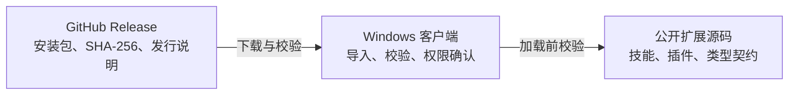

# Mars AI：把可审查的能力带到本地 AI 工作流

> 下载客户端、查看扩展源码、参与技能与插件生态。

[下载 Windows 客户端](#下载-windows-客户端) · [开始贡献](CONTRIBUTING.md) · [安全报告](SECURITY.md) · [技能示例](skills/extension-authoring/)



## 这是什么

Mars AI 是一个面向本地 AI 工作流的扩展生态：客户端负责本地导入、兼容性检查、权限展示与用户确认；本仓库公开可审查的扩展源码、技能规范、宿主类型契约和客户端发行元数据。

你可以在这里阅读扩展如何声明能力与完整性，基于技能示例构建自己的扩展，并通过可复现的检查参与改进。桌面客户端以 Release 二进制提供；客户端源码、官网、市场服务、部署配置和运行时数据不在本仓库。

## 为什么值得关注

| 可审查 | 可验证 | 用户可控 |
| --- | --- | --- |
| 插件与技能源码、许可证和扩展元数据可公开阅读。 | 可加载文件通过 `mars-extension.json` 中的 SHA-256 完整性清单校验。 | 客户端在导入或启用前展示权限；下载不等于安装或执行。 |

## 公开内容与边界

```text
公开：plugins/、skills/、公开宿主类型契约、许可证、贡献规范、Release 校验和
私有：客户端源码、官网、市场服务、构建 Runner、部署配置、数据库与运行时数据
```

- `plugins/`：14 个历史 SNF 插件源码，适合审查、学习和迁移；它们不是可直接上架的市场制品。
- `skills/`：可导入的技能内容。`skills/extension-authoring` 是正式的结构与完整性示例。
- `packages/host-contracts/`：插件编译所需的公开宿主类型契约，不包含私有运行时实现。
- [GitHub Releases](../../releases)：Windows 客户端安装包、校验和与发行说明。

## 下载 Windows 客户端

当前稳定版本：[v1.0.0](../../releases/tag/v1.0.0)

| 架构 | 下载 | SHA-256 |
| --- | --- | --- |
| Windows x64 | [mars-1.0.0-64.exe](../../releases/download/v1.0.0/mars-1.0.0-64.exe) | `66f272ea6b640f34bbe3d44bd60acfd63be499dcfb034cfe4a1e2ff6e33be47c` |
| Windows x86 | [mars-1.0.0-32.exe](../../releases/download/v1.0.0/mars-1.0.0-32.exe) | `d949f8e3d8ef5cb9a8e1e71d708a584ab34f35f543f6bc41eec4b7196ff6d61b` |

下载后请从同一 Release 获取 `SHA256SUMS.txt` 并校验文件。Windows PowerShell 示例：

```powershell
Get-FileHash .\mars-1.0.0-64.exe -Algorithm SHA256
```

返回值必须与上表或 `SHA256SUMS.txt` 一致。macOS 与 Linux 版本尚未发布。

## 从一个技能开始

1. 阅读 [扩展编写技能](skills/extension-authoring/SKILL.md)。
2. 复制目录结构，为你的扩展创建根目录 `mars-extension.json`、许可证、README 与测试。
3. 只声明完成任务所需的最小权限，为每个可加载文件写入 SHA-256。
4. 在干净环境执行检查，再按 [贡献指南](CONTRIBUTING.md) 发起 Pull Request。


## 如何贡献

欢迎以下类型的贡献：

- 改进技能、示例、扩展元数据和公开宿主类型契约；
- 把历史插件迁移为独立、可测试、可安装的扩展；
- 改进中文文档，并为未来的语言版本补充术语与翻译提案；
- 报告文档问题、安装体验、校验问题和可复现的兼容性问题。

提交前请阅读 [贡献指南](CONTRIBUTING.md)。安全漏洞请按 [安全策略](SECURITY.md) 私下报告，不要在公开 Issue 中附带凭据、用户数据或可直接利用的细节。

## 如何支持项目

当前未开放资金赞助、收款地址或第三方众筹渠道。你仍可通过以下方式帮助项目成长：

1. 提交可复现的 Issue 和改进建议；
2. 提交技能、文档、测试或已迁移的扩展；
3. 验证新版本的安装、校验与权限提示；
4. 向需要本地可控 AI 扩展能力的开发者分享本项目。

## 本地检查

```bash
pnpm install
pnpm typecheck
pnpm verify
```

`pnpm verify` 会检查公开树中是否包含常见凭据、环境文件、数据库或构建产物。